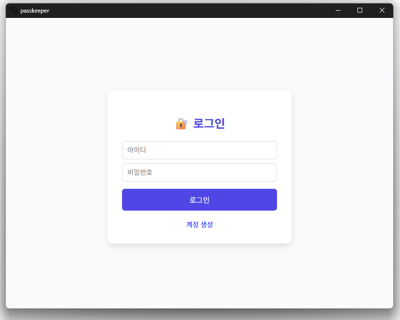
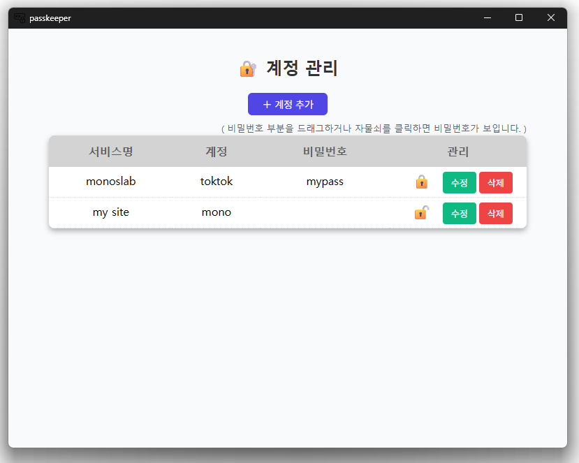

# PassKeeper

## Features

A Windows application for managing passwords.

## Installation

You need to install the required modules once using 'pnpm install' in the project's root directory.

## Distribution Folder Structure   

📂root   
├─📂data   
│  └─📄user.dat   
└─📄passkeeper.exe   

## Development Tool Versions

* RUST Version : v.1.96.0 (ac68faa20 2026-05-25)
* TAURI Version : v.2.11.5
* TAURI-API Version : v.2.11.1
* TAURI-CLI Version : v.2.11.4

## Version Information

### v.1.0.0

* Initial version

## Screen

* Login Screen:

* Main Screen:

## Key Development Notes

### crypto   
* It is necessary to redefine the encrypt_data, decrypt_data, and hash_data functions.   
> The encryption and hash parts must be added and developed individually. (By default, data is stored without encryption)   
 (* Location: src-tauri > src > module > crypto.rs )   

### Bundle.js Bundling  

Bundling is required. Refer to the comments at the beginning of bundle.js for guidance.

### tauri.conf.json

* tauri.conf.json : References a locally saved schema file. (src-tauri/schema/config.schema.json)
* If issues occur after updating Tauri version with local reference, download and use the file from [config.schema.json](https://github.com/tauri-apps/tauri/blob/dev/crates/tauri-schema-generator/schemas/config.schema.json)  
